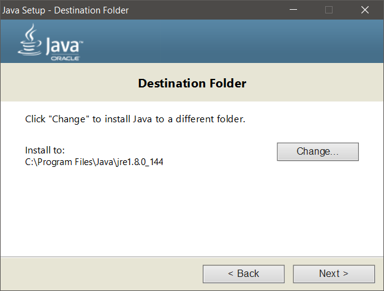

Complete Java Install/Run Guide + Editor Choices
================================================

###### By Syed Safwaan, Minister of Pythonic Affairs 2017-2018

In this guide, we'll be comprehensively going over how to install **Java and an editor (multiple options shown).**

* * *

Introduction _(skip at your own peril)_
---------------------------------------

### Brief Overview of Language

Java is a high-level compiled, object-oriented (OOP) language. It's very popular in the field of software development, and is a commonly used language in applications ranging from games to business tools. For a beginner, Java may be intimidating to deal with. However, with time and use, it quickly becomes natural and perhaps a favourite language as well, once its merits are realized.

### Differences from Python

As stated above, Java is a _compiled language_. This is very different from Python, which is an _interpreted language_. _Interpreted_ means that a program on your computer goes through your code **line-by-line** and executes each on the computer. It's a friendlier type of language, evident by the existence of Python Shell and IDLE, where you can both run code line by line (shell) and save programs (IDLE).  
  
However, _compiled_ means that **at startup**, all the code is compressed into a readable format when you hit "run." Then, the code is all executed "at once," resulting in very fast programs. However, because of its compiled nature, there is no Java Shell (until [Java 9](https://docs.oracle.com/javase/10/jshell/introduction-jshell.htm), that is). Java doesn't come with an IDLE either; it only has the libraries and the compiler when installed. This makes installing and running Java programs much more unintuitive for beginners coming from Python.

### Purpose of This Guide

Installing Java is very different from installing Python. Sure, you can use [repl.it](https://repl.it/) or some other online editor to write your code and avoid the hassles, but installing Java on your computer is certain to get you the best programming environment. With ICS4U approaching soon, it's imperative that we all get in some good Java XP before we enter, as Gr 12 CS is much more difficult than Gr 11, and best if not BSed :). \*cough\*  
  
With that out, I think it's safe to say that it's in all of your best interests to give Java at least a quick whirl before the school year.

### Intended Audience

This guide is intended for **inexperienced users** who aren't sure how to configure Java correctly and would like some assistance. If you have more than rudimentary knowledge on how to install tools for a language and configure an editor, this guide will likely bore you.  
  
While this guide uses Windows 10 to demonstrate the procedure, a user of any OS can follow along and perform the same steps with minor modifications.

* * *

PART 1 - INSTALLING JAVA
------------------------

##### _We are using Java 8 for this guide. If you wish to use a newer version, note the differences between your screen and my crops and decide accordingly._

Installing Java is really just installing the libraries and the compiler. These things are put into a package called a **JDK**, or **Java Development Kit**.

**_A. Go to the [Java JDK download page](http://www.oracle.com/technetwork/java/javase/downloads/jdk8-downloads-2133151.html) and select a JDK for your computer_**

In the first link selection article, click "Accept License Agreement" and click the link that corresponds with your system (Windows x86 and Windows x64)*.

##### _This depends on the bits and your operating system. To check the number of bits on your system, just navigate to My Computer, right click, select Properties and you should see your bitsize._

##### _\* \- Newer versions of Java only offer 64-bit downloads. If you're using an older 32-bit system, downgrade your Java version._

Remember to Accept License Agreement.

**_B. Run the downloaded executable_**

This step is simple enough. Just run the installer and say OK to all the settings. If you are confident and want to tamper with a few install settings, do so at your own peril. **Remember the directory you save Java to.**

    

With that, Java is now on your system! It's still unusable (for normies) because we don't have an editor (smh normies), but it's now on your computer.

* * *

PART 2 - INSTALLING AND USING EDITOR (JCreator)
-----------------------------------------------

**_X. Preface_**

JCreator is a light **IDE**, which stands for **I**ntegrated **D**evelopment **E**nvironment. Because Java doesn't have an IDLE or a shell like Python does when installed, we will use JCreator when developing applications (or normal programs, for normies).  
  
[Click here to download the installer and setup executable.](jcrea450_setup.exe) McKenzie gives this one at the start of the year.

**_A. Run the executable to install JCreator_**

The installation of JCreator is as simple as the installation of Java. Verfiy everything as usual and follow the cues in the images shown.

  

**_B. Set up general runtime settings on JCreator boot_**

JCreator should boot immediately after finishing the installation. On boot, it will ask for more configurations relating to the way you want Java to work in the editor. **Follow any cues in the images.**

   

**_C. Make a Java project_**

Making a Java file isn't as simple as Python. When you make a Java file, you actually need to make a _project_, which contains packages and source files to run your Java code. It's complicated to explain, but thankfully you don't need to worry about it for the most part. Just follow the steps shown below.

1.  Open JCreator by double-clicking the icon on your desktop or opening your app list in the Start menu and clicking on the JCreator icon.
2.  Once the window opens, disable and/or close the tips window that pops up (not important) and navigate to:  
      
    **File >> New >> Project...**  
      
    Additionally, you can just hit **Ctrl + Shift + N** to open a new project.
    
3.  Select "Basic Java Application" as your project template and hit Next.  
    
4.  Name your project and save it to a directory. **Do not use spaces or any special symbols or characters. Letters and underscores only.** Afterwards, hit Finish, then Finish again when the loading is done.  
     

**_D. Run a Java project_**

When you finish making your project, your should have a new editor open, with a template waiting for you :). You can study the code for a bit, but you're going to want to run it.  
  
It's much easier than you think. Just **click the Run button at the top of the window** and see the code run. Additionally, you can just hit **F5**. The output is at the bottom of the editor, in the General Output window.

* * *

Conclusion
----------

By the end of this tutorial, you install Java and are able to run Java code in an editor. This is the part where you go and do some more work in Java to prepare for next year. Make this CS year great. Take some courses online, watch some quick videos, and above all else, write your own code, develop your own style and solve some problems.
